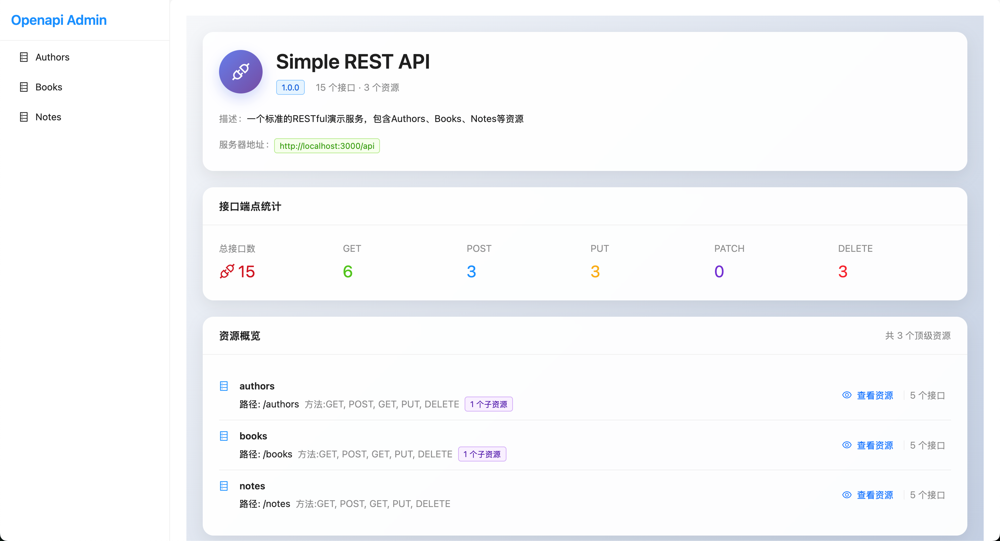
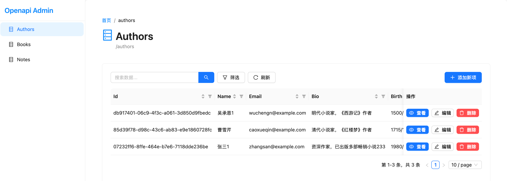
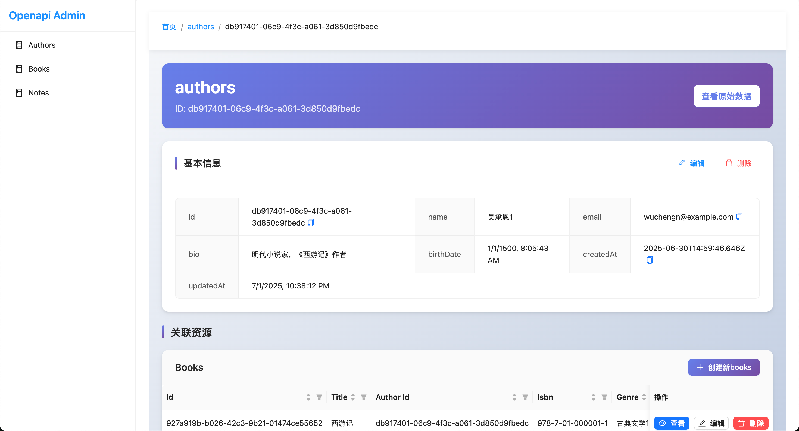

<div align="center">
  <h1>🚀 OpenAPI Admin</h1>
  <p>Automatically generate admin interfaces from OpenAPI specifications</p>
  
  [](https://reactrouter.com/)
  [](https://www.typescriptlang.org/)
  [](https://reactjs.org/)
  [](https://ant.design/)
  [](https://opensource.org/licenses/MIT)

  
</div>

---

## What is OpenAPI Rest Admin?

OpenAPI Rest Admin is a **Single Page Application** that automatically creates admin interfaces from your OpenAPI/Swagger specifications. Point it to your API documentation, and get a fully functional admin panel with tables, forms, and CRUD operations - no coding required.

### Key Benefits

- **Zero Setup**: Works entirely in the browser, no backend needed
- **Automatic UI**: Generates tables and forms from your API schemas
- **Modern Stack**: Built with React 19, TypeScript, and Ant Design
- **Production Ready**: Deploy as static files anywhere

## How It Works

1. **Provide OpenAPI Spec**: Configure your OpenAPI document URL
2. **Auto-Discovery**: The app analyzes your API to identify resources
3. **Generate Interface**: Creates tables, forms, and navigation automatically
4. **Direct API Calls**: Makes HTTP requests directly to your API endpoints

## 🚀 Quick Start

### Prerequisites

- Node.js 18+ and npm

### Installation

1. **Clone and install**

   ```bash
   git clone https://github.com/your-username/openapi-rest-admin.git
   cd openapi-rest-admin
   npm install
   ```

2. **Configure your API**

   Create a `.env` file:

   ```bash
   # Your OpenAPI specification URL
   VITE_OPENAPI_DOC_URL=https://your-api.com/openapi.json

   # Optional: Custom title
   VITE_APP_TITLE=My API Admin
   ```

3. **Start development server**

   ```bash
   npm run dev
   ```

4. **Open http://localhost:5173**

### Try with the Example REST Server

The project includes a demo REST server that provides a complete RESTful API with Authors, Books, and Notes resources:

1. **Start the example server**

   ```bash
   cd example/simple-rest-server
   chmod +x start.sh
   ./start.sh
   ```

   The server will run at `http://localhost:3000` with API documentation available at `http://localhost:3000/api-docs`

2. **Configure the admin interface to use it**

   ```bash
   # In your .env file
   VITE_OPENAPI_DOC_URL=http://localhost:3000/openapi.json
   ```

3. **Open the admin interface at http://localhost:5173**

This example server includes full CRUD operations for multiple resources and serves as an excellent demonstration of OpenAPI Admin's capabilities.

## 📜 Available Scripts

```
| Command | Description |
|---------|-------------|
| `npm run dev` | Start development server |
| `npm run build` | Build for production |
| `npm run test` | Run tests with Vitest |
| `npm run test:ui` | Run tests with interactive UI |
| `npm run typecheck` | TypeScript type checking |
| `npm run config:generate` | Generate configuration files |
```

## ⚙️ Configuration

### Environment Variables

Create a `.env` file in the project root:

```bash
# Required: Your OpenAPI document URL
VITE_OPENAPI_DOC_URL=https://your-api.example.com/openapi.json

# Optional: Custom application title
VITE_APP_TITLE=My API Admin
```

### Runtime Configuration

You can also configure the application at runtime by editing `public/config.json`:

```json
{
  "openapiDocUrl": "https://your-api.example.com/openapi.json",
  "appTitle": "My API Admin"
}
```

### Configuration Priority

The application loads configuration in the following order:

1. Environment variables (highest priority)
2. Default values

## � Standalone Usage (Script Tag)

You can use OpenAPI Rest Admin as a standalone library, similar to Scalar API Reference:

### Quick Setup

1. **Build the standalone version**

   ```bash
   npm run build:standalone
   ```

2. **Use in your HTML**

   ```html
   <!DOCTYPE html>
   <html>
   <head>
       <title>My API Admin</title>
       <link rel="stylesheet" href="path/to/openapi-rest-admin.css">
   </head>
   <body>
       <div id="app"></div>
       <script src="path/to/openapi-rest-admin.js"></script>
       <script>
           OpenAPIRestAdmin.createAdminInterface('#app', {
               openapiDocUrl: 'https://api.example.com/openapi.json',
               siteTitle: 'My API Admin'
           });
       </script>
   </body>
   </html>
   ```

### Try the Demo

```bash
npm run demo:standalone
```

This will build the standalone version and start a demo server at http://localhost:3000

For complete standalone usage documentation, see [docs/STANDALONE_USAGE.md](docs/STANDALONE_USAGE.md).

## �🚀 Production Deployment

### Static File Hosting

1. **Build the application**

   ```bash
   npm run build
   ```

2. **Deploy to any static hosting**

   ```bash
   # Copy built files to your web server
   cp -r build/client/* /var/www/html/

   # Or use a static file server
   npx serve build/client
   ```

3. **Update configuration**

   Edit `config.json` in your deployed files:

   ```json
   {
     "openapiDocUrl": "https://your-production-api.com/openapi.json",
     "appTitle": "Production API Admin"
   }
   ```

### Docker Deployment

```dockerfile
# Dockerfile included in the project
docker build -t openapi-rest-admin .
docker run -p 5173:5173 openapi-rest-admin
```

## 🔧 Supported OpenAPI Features

### Resource Detection

- Standard REST patterns (GET, POST, PUT, DELETE)
- Path parameters (`/users/{id}`)
- Query parameters (filtering, pagination)
- Request/response schemas

### Schema Support

- Basic types (string, number, boolean)
- Complex types (objects, arrays)
- Validation (required fields, formats, enums)
- Example values

## � Troubleshooting




### Common Issues

1. **CORS Errors**: Ensure your API allows cross-origin requests
2. **Invalid Schema**: Check that your OpenAPI spec is valid JSON/YAML
3. **No Resources Found**: Verify your spec contains standard REST patterns
4. **Config Loading Failed**: Check browser console for errors

### Debug Mode

```javascript
localStorage.setItem("debug", "openapi-rest-admin:*");
```

## 🤝 Contributing

See [CONTRIBUTING.md](CONTRIBUTING.md) for detailed guidelines.

Quick start for contributors:

1. Fork and clone the repository
2. Run `npm install` and `npm run dev`
3. Make your changes and add tests
4. Submit a pull request

## License

MIT License - see [LICENSE](LICENSE) file for details.

## 🙏 Acknowledgments

- [React Router v7](https://reactrouter.com/) - Routing and SSR
- [Ant Design](https://ant.design/) - UI components
- [swagger-parser](https://github.com/APIDevTools/swagger-parser) - OpenAPI parsing

---

**Made with ❤️ for the API development community**
